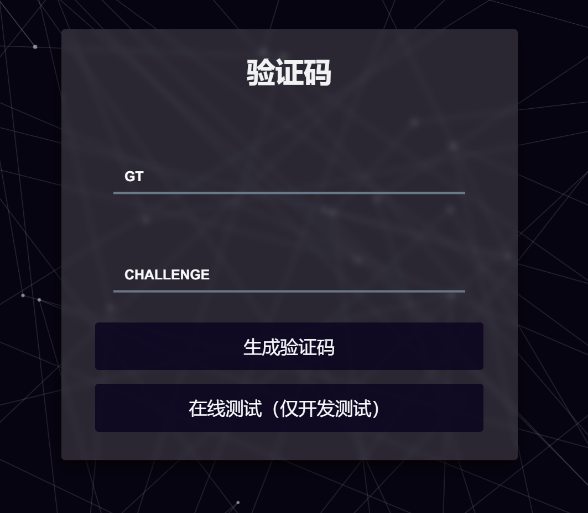
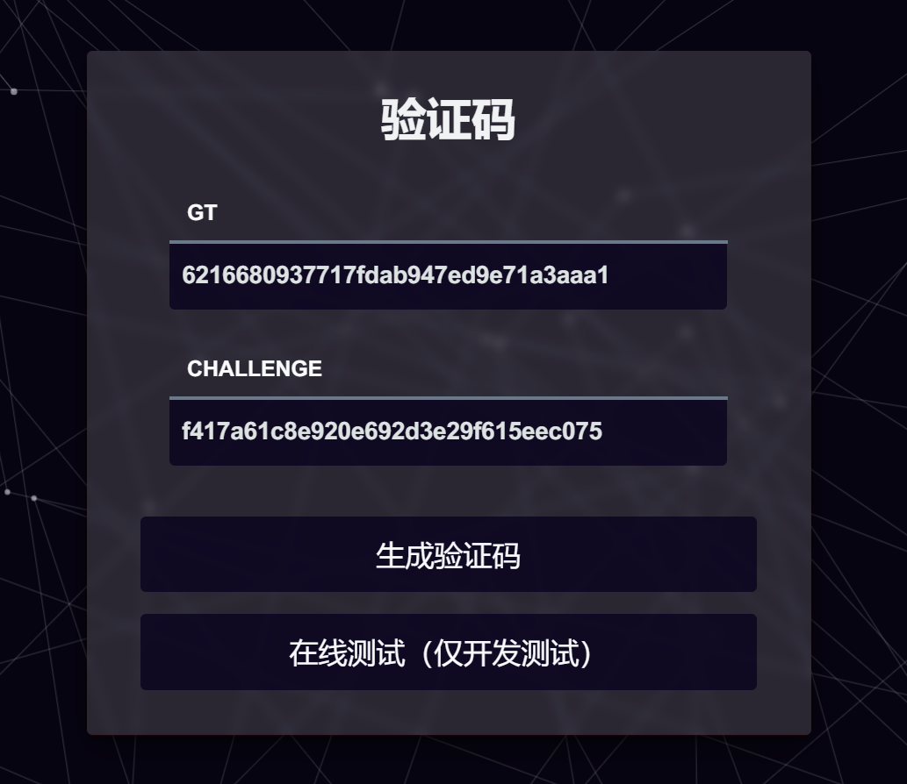
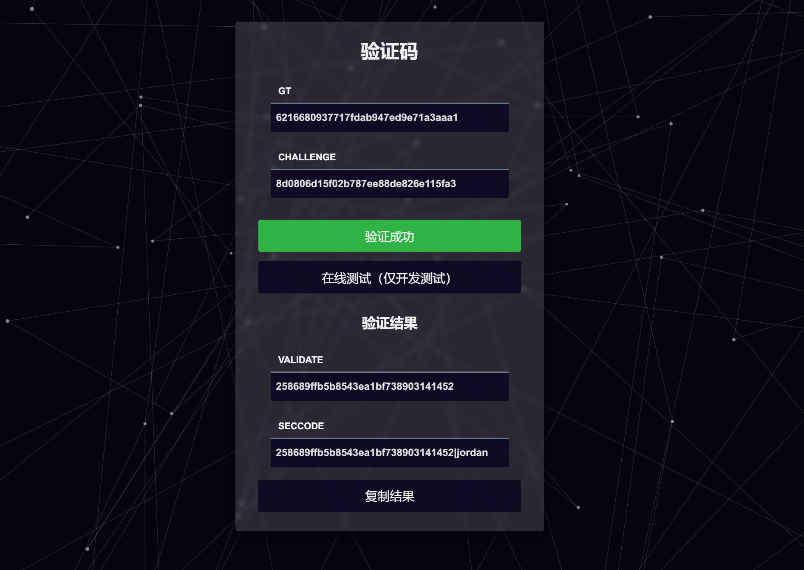
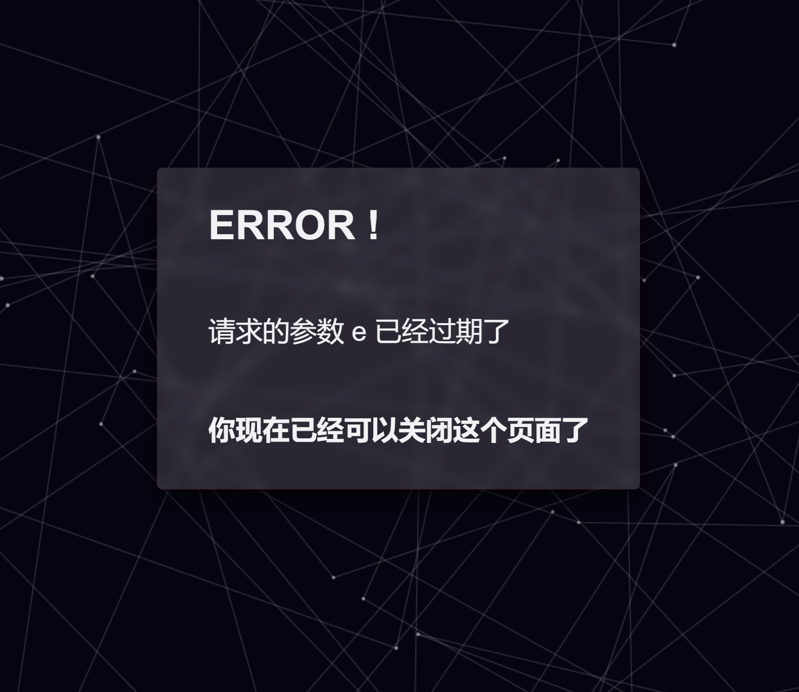
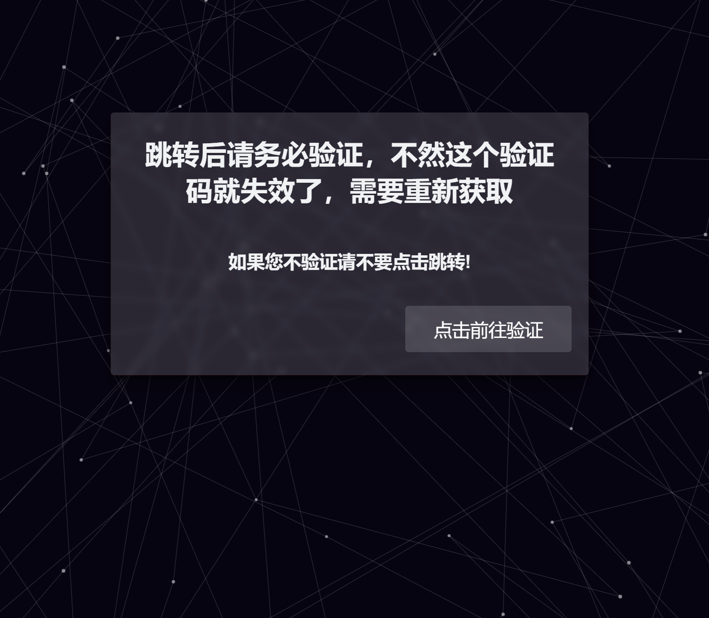

# geetest-manual-validator
极验手动验证服务器
## 安装
```
# Gitee
git clone --depth=1 https://gitee.com/ikenxuan/geetest-validator.git

# GitHub (可能更新不及时)
git clone --depth=1 https://github.com/ikenxuan/geetest-validator.git
```
```
# 安装nodejs依赖 npm 、pnpm 或 yarn
npm install
```

## 使用
```
# 前台启动
node app
```
```
# 后台启动
npm run start
```
```
# 后台注销
npm run stop
```

```
# 输出日志
npm run log
```
默认监听 `[::]`:3001，可通过修改 `config.yaml` 更改

服务器开放端口即可对外访问

## 接口
### 只有一个接口 `/geetest` <br><br>可通过提交的参数不同而实现不同功能，支持 `[GET]` 和 `[POST]`

***
**[GET]** 主页 `/geetest`
```
# 直接访问，可手动输入参数触发验证
```

**[GET]** 字段 `gt` 和 `challenge`
```
# 通过URL地址获取指定参数
/geetest?gt={gt}&challenge={challenge}
```

**[GET]** 字段 `callback`
```
# 验证地址回调接口
/geetest?callback={e}
```
```
# 返回示例
{
    "retcode": 200,
    "data": {
        "geetest_gt": "e52c06c937981b90b275d0aff1d40076",
        "geetest_challenge": "680ab0b3f4a2b5b97399e3c4eed601ea",
        "geetest_validate": "94c627a4771c0881d5ccedc436355184",
        "geetest_seccode": "94c627a4771c0881d5ccedc436355184|jordan"
    },
    "geetest": {
        "gt": "e52c06c937981b90b275d0aff1d40076",
        "challenge": "680ab0b3f4a2b5b97399e3c4eed601ea"
    },
    "e": "Vm14Rk9WQldhejFXdQ==",
    "verified": true
}
```

**[GET]** 字段 `e`
```
# 短链地址
/geetest?e={token}
```
***
**[POST]** 主页 `/geetest`

**`body.url`**

*请求示例*
```
# Body
{
    "url": "https://api.example.com/geetest?gt={gt}&challenge={challenge}"
}
```
*请求示例*
```
# Body
{
    "status": 0,
    "message": "OK",
    "data": {
        "token": "VlROak9WQlhXVDEyOQ=="
    }
}
```
<br>

**`body.gt` 和 `body.challenge`**

*请求示例*
```
# Body
{
    "gt": "3101554dd48afd3d07e93bd872d4492c",
    "challenge": "dc45e58c3874cc247a8d8e8ff34839af"
}
```
*返回示例*
```
# Body
{
    "status": 0,
    "message": "OK",
    "data": {
        "link": "http://api.example.com/geetest?e=VjJ4Rk9WQldTVDFtYQ==",
        "result": "http://api.example.com/geetest?callback=VjJ4Rk9WQldTVDFtYQ=="
    },
    "geetest": {
        "gt": "3101554dd48afd3d07e93bd872d4492c",
        "challenge": "916e8df0d7d53a2cbd538a422ed68ff0"
    },
    "e": "VjJ4Rk9WQldTVDFtYQ==",
    "verified": false
}
```

## UI样式







## 参考
https://github.com/Colter23/geetest-validator<br>
https://gitee.com/QQ1146638442/GT-Manual