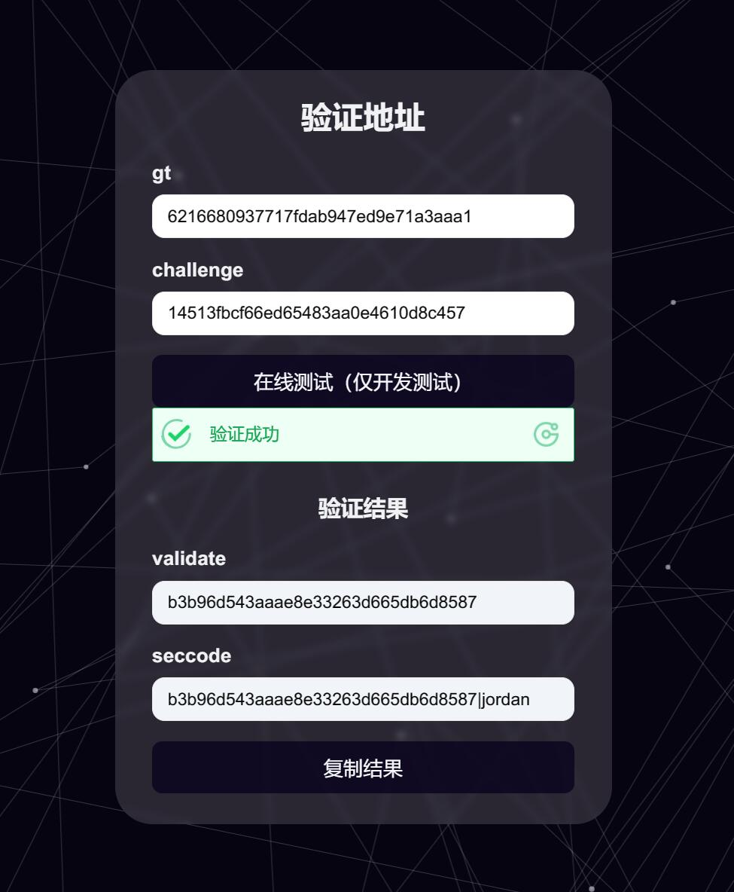
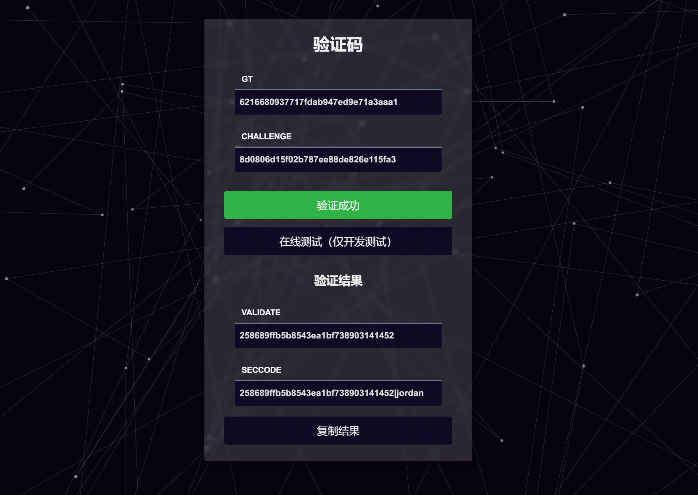

# geetest-manual-validator
极验手动验证服务器
## 安装
```
# Gitee
git clone --depth=1 https://gitee.com/ikenxuan/geetest-validator.git

# GitHub (更新不及时)
git clone --depth=1 https://github.com/ikenxuan/geetest-validator.git
```
```
# 安装依赖 npm 、pnpm 或 yarn
npm install
```
## 使用前必做
**！！在文件 `js/index.js` 中修改 `serverUrl` 的值为你实际的IP或域名**<br>

## 使用
```
# 前台启动
node app
```
```
# 后台启动
npm run start
```
```
# 后台注销
npm run stop
```

```
# 输出日志
npm run log
```
默认监听 `0.0.0.0`:3001

服务器开放端口即可对外访问

## 接口
```
# 验证页面手动输入指定参数
[GET] /geetest

# 从url获取指定参数
[GET] /geetest?gt={gt}$chalenge={challenge}

# 验证接口回调
[GET] /geetest?callback={challenge}

# 获取短链参数
  * 在 `请求体` 中传入 `url` 字段为需要跳转的实际地址，返回字段 `token` 
[POST] /geetest

# 短链跳转接口
[GET] /geetest?e=token


```
## 手动输入参数


  

## 从url获取参数
```
# 接口地址
/geetest?gt={gt}&challenge={challenge}
```

## 短链跳转



### 魔改 https://github.com/Colter23/geetest-validator ，感谢